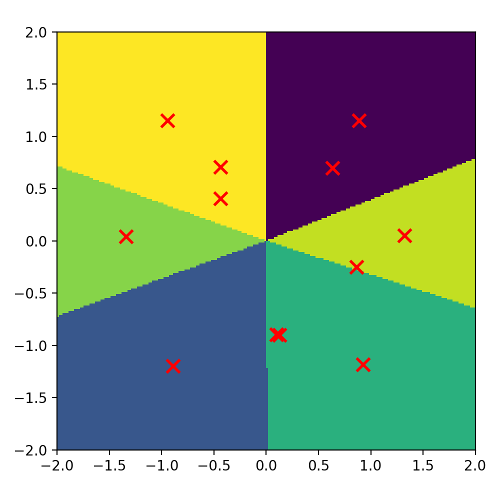
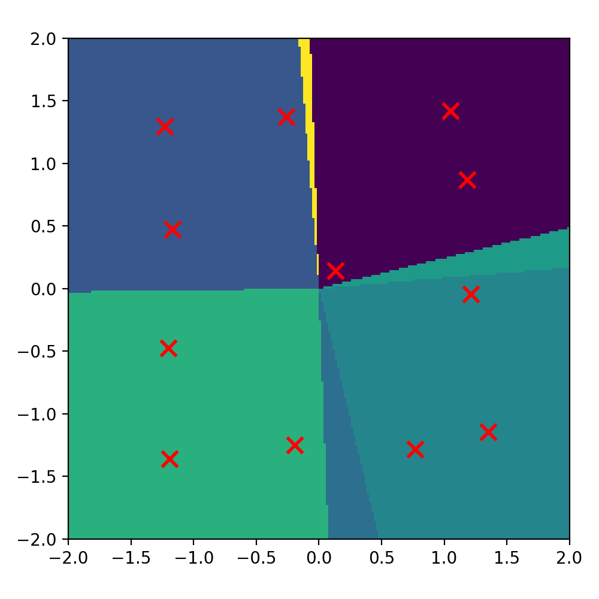
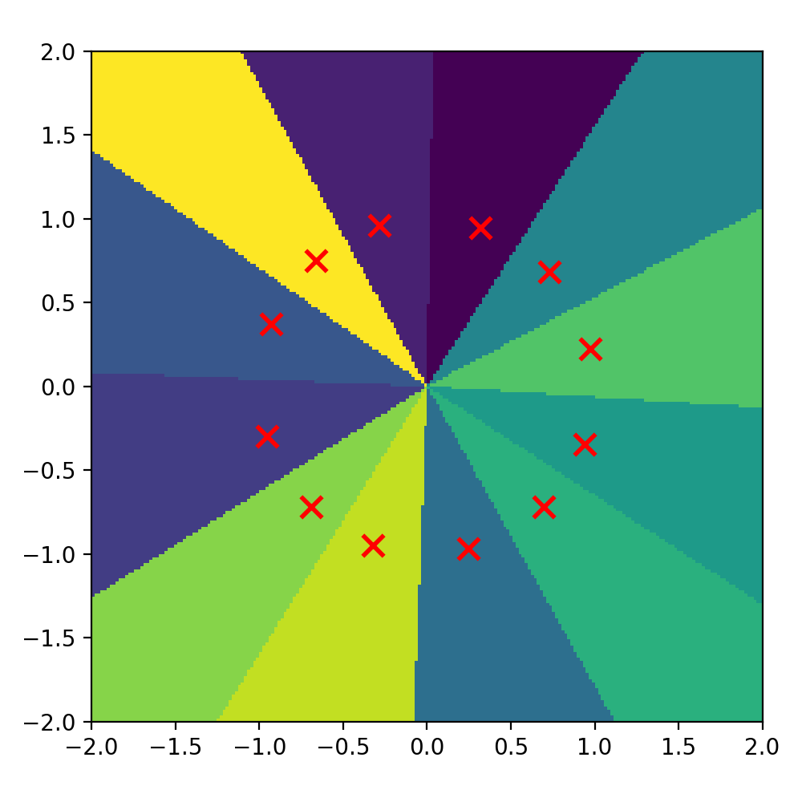
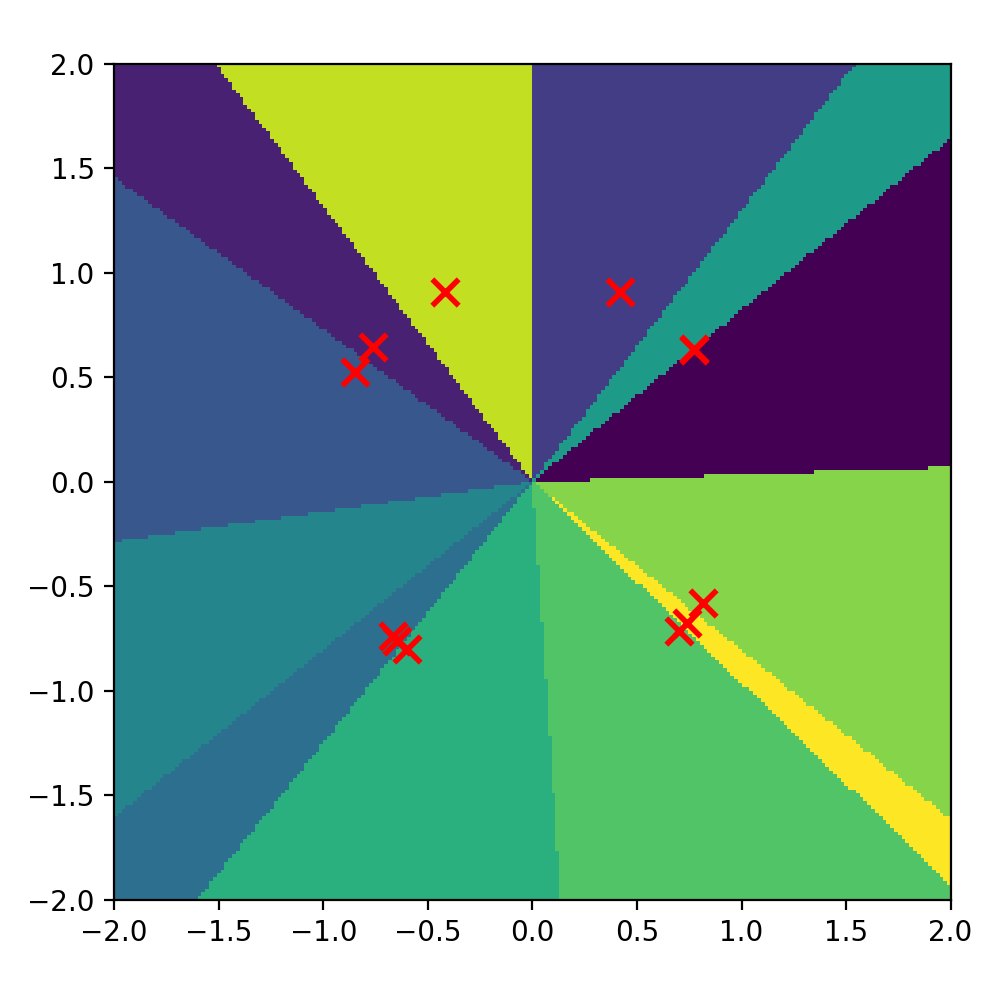
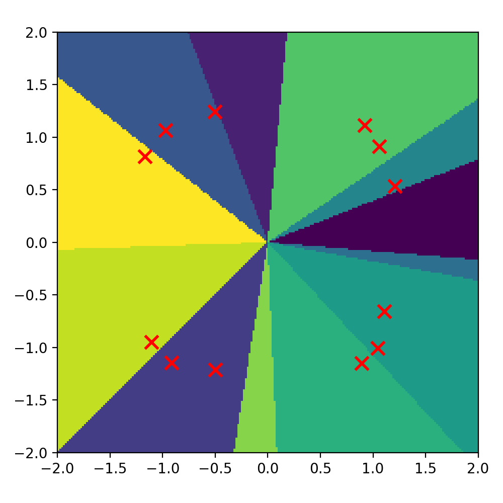
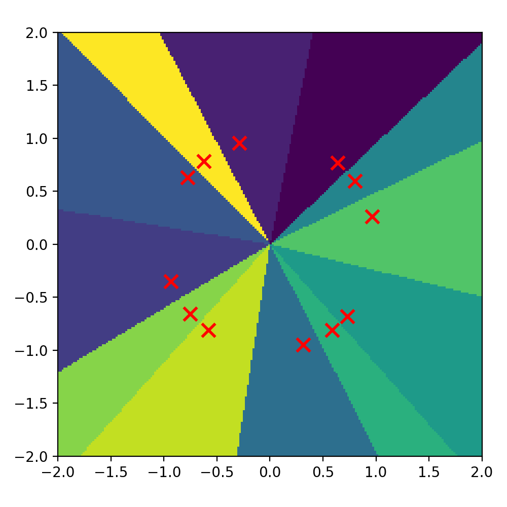
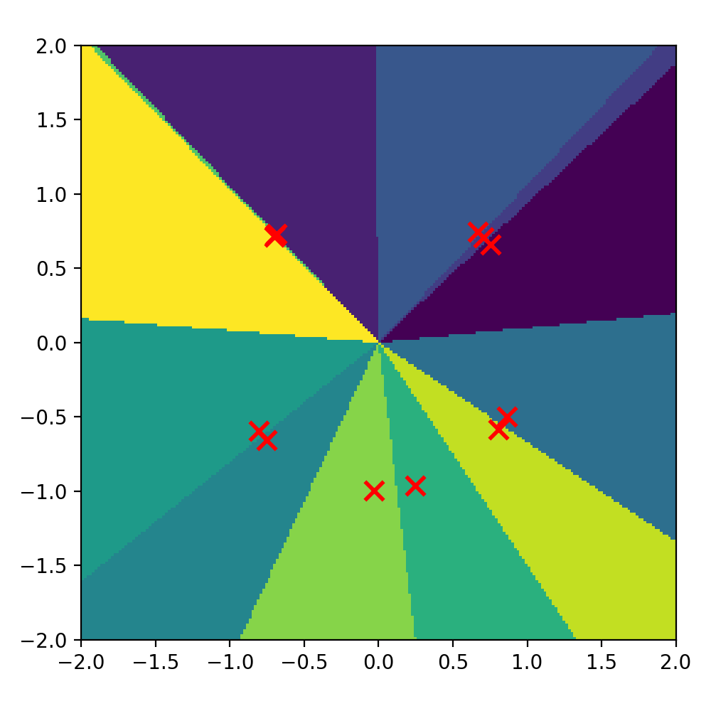

Made with ☕ + PyTorch

# 🧠 Self-Organizing Networks — WTA vs WTM (PyTorch)

Small, practical project exploring **competitive learning** in a self-organizing network:
- **WTA** (Winner Takes All)
- **WTM** (Winner Takes Most / winner + neighborhood)

We compare:
- **with / without normalization**
- **with / without neuron fatigue**
- and visualize the final **space partitioning** on a 2D plane.

---

## ✅ What’s inside

- 2D input space: random points from **[-2, 2] × [-2, 2]**
- one layer of **M competitive neurons** (prototypes / weight vectors)
- **WTA**: only the winner gets updated  
- **WTM**: winner + `k` nearest neighbors (based on distance in weight space)
- optional **L2 normalization** (inputs + weights)
- optional **fatigue** (penalty for neurons that win too often)
- automatic generation of **all 8 variants** and saving plots as `.png`

---

## 🎮 Project overview

The network learns without labels and without a training dataset.
Instead, during training it repeatedly:
1. samples a random point `x`
2. computes responses of all neurons
3. picks the **winner** (random tie-breaking if needed)
4. updates weights toward `x` (WTA or WTM)
5. optionally applies **fatigue** to reduce repeated wins by the same neuron

After training, we create a dense grid over the plane and assign each point to the neuron
with the strongest response — that gives the final **partitioning**.

---

## 🖼️ Results (saved images)

Each run produces **8 images** (WTA/WTM × norm on/off × fatigue on/off).
Put them into `assets/`:

### WTA
- **WTA | norm=false | fatigue=false**  
  

- **WTA | norm=false | fatigue=true**  
  

- **WTA | norm=true | fatigue=false**  
  

- **WTA | norm=true | fatigue=true**  
  

### WTM
- **WTM | norm=false | fatigue=false**  
  

- **WTM | norm=false | fatigue=true**  
  

- **WTM | norm=true | fatigue=false**  
  

- **WTM | norm=true | fatigue=true**  
  

> Red **X** markers show the final positions of neuron weight vectors (prototypes).

---

## ⚙️ Hyperparameters

All values are grouped at the top of the script:

- `seed` – reproducible runs
- `box_min`, `box_max` – input range (default: `[-2,2]`)
- `neurons` – number of neurons `M`
- `steps` – training steps
- `eta_start`, `eta_decay` – learning rate schedule (`eta` decreases over time)
- `neigh_k`, `neigh_sigma` – neighborhood size/strength (used in WTM)
- `fatigue_lambda`, `fatigue_add`, `fatigue_decay` – fatigue penalty settings
- `grid_res` – resolution of the partition plot
- `out_dir` – output directory for images (you can later move them to `assets/`)

---

## 📝 Notes

- **Normalization** makes responses depend more on direction than magnitude,
  which often creates a more “radial / wedge-like” partitioning.
- **Fatigue** helps prevent one neuron from winning too often (more balanced competition).
- During training ties are broken **randomly**; for plotting we use `argmax` for stable boundaries.

---

## ▶️ Run

```bash
python main.py
